# Hack 2021 Theme The Wildcard
 
 
 <p align="center">
    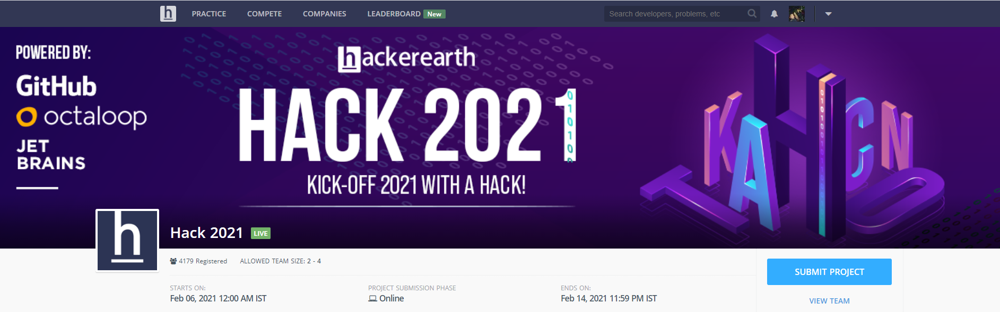
    <br>
    <sup><a href="https://hack2021.hackerearth.com/" target="_blank">HACK 2021</a></sup>
</p>


A cross-platform desktop application for monitoring and analyzing from a live camera feed or videos files to analyze data for

    1.  Exam Environment: Monitor if students are participating in any malpractices during the exam.  
    2.  Covid Environment: Monitor if all person are wearing mask and following social distancing protocol.
    3.  School Buses: Driver drowsy, a driver talking on a cellphone while driving, driver/conductor smoking in the bus, etc
    4.  Hostel Environment: Students outside dorms after designated timings, Unauthorized entry in campus, etc.
    5.  Corridor Environment (outside classroom): Gents entering ladies' washrooms and vice versa.
    
After Videos are analysed using Machine & Deep Learning, it saves and sends data via Email, What's App Bots, and Telegram Bots via API Tokens/keys.

This Application was created for Participating in HackerEarth Challenges HACK 2021 <a href="https://hack2021.hackerearth.com/">HACK 2021</a>


 <p align="center">
    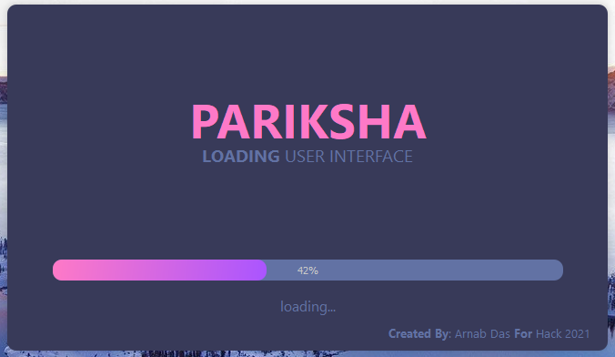
    <br>
    <sup><a href="https://hack2021.hackerearth.com/" target="_blank">HACK 2021</a></sup>
</p> 


## THEME 1 (Intelligent Video Monitoring) :camera_flash:

Develop a layer of analysis over video feed. It should be focussed around applications in a school or a classroom environment.

    Minimum Requirements
    
    Develop a layer of analysis over video feed. It should be focussed around applications in a school or a classroom environment.

    Some examples-
    
        1.  Classroom environment: How much students are participating in discussions, how is the discipline in the class etc
        2.  School environment (outside classroom): Discipline in corridors and open areas, Gents entering ladies washrooms and vice versa, Detecting vandalism, Detecting medical emergencies etc
        3.  Hostel environment: Students outside dorms after designated timings, Unauthorized entry in campus etc
        4.  School Buses: Driver drowsy, driver talking on cellphone while driving, driver/conductor smoking in the bus etc
    
    The analysis can be on live feed triggering alerts in real-time or on recorded feed for consolidated analysis
    
    On Front End:
    
        Build an interface to upload a video for analysis
        Display results in a presentable manner for the uploaded video
        Display results of previously uploaded videos
        Send Data to Telegram/Whats App through API
    
    On Back end:   
    
        Build the algorithm to analyze the video and identify the event(s) of your choice
        Store the clip showing the event occurrence and capture the relevant details
        The data sharing between Frontend and Backend should be in JSON format rendered over REST APIs.
        Zip all your Source Code, Screenshots, Deployment Instructions/Readme and Upload
    
    
# INTELEGIX WORKING SAMPLE

- For Video Demostration refer to the YouTube link <a href="https://youtu.be/GAfp1vnejlY">here.</a>

## GUI INTERFACE SAMPLES

<p align="center">
    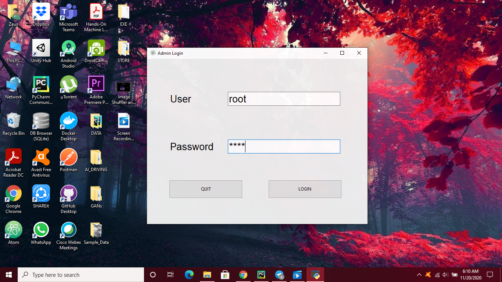
    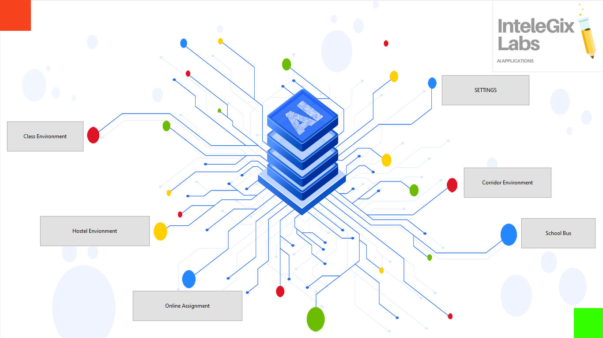
    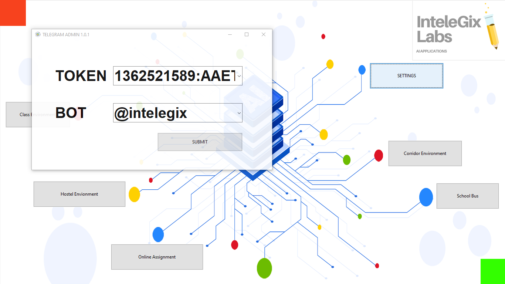
    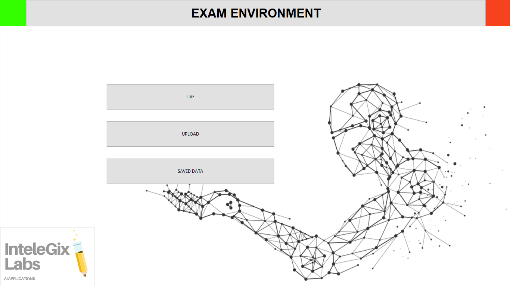
    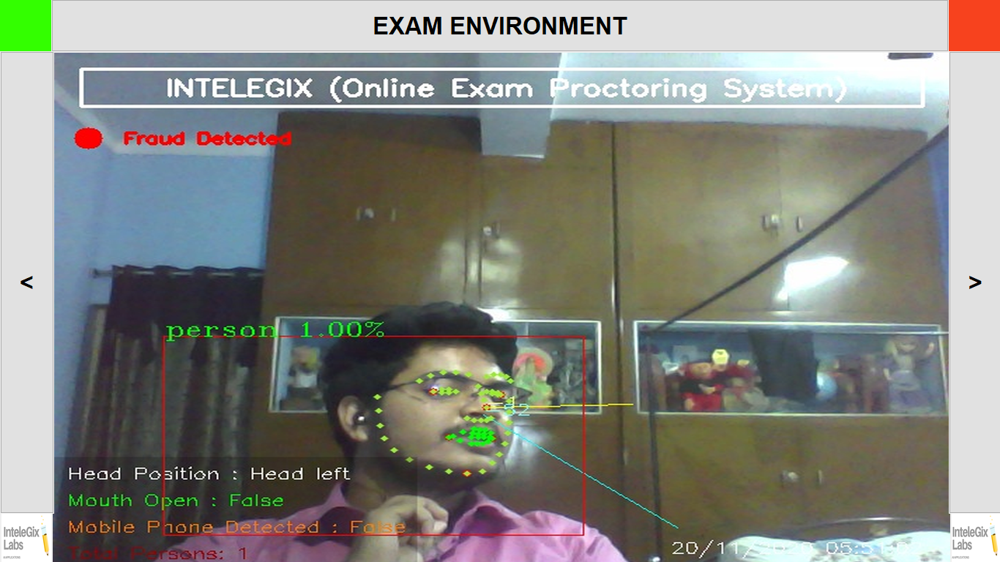
    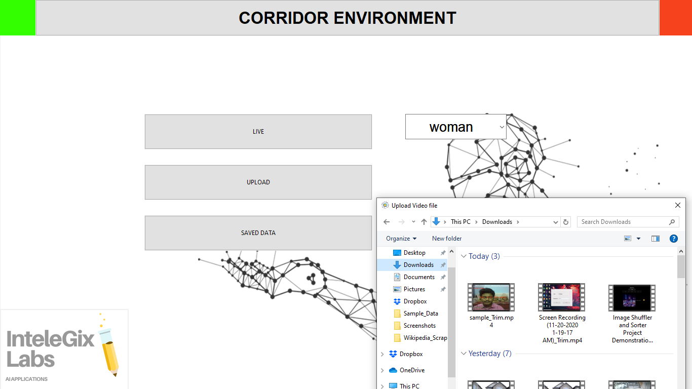
    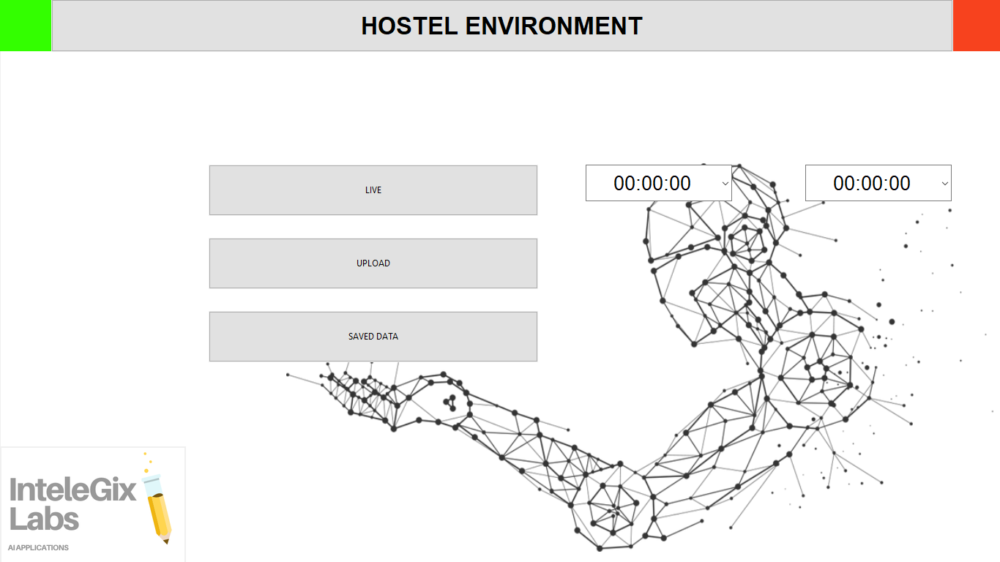
    
    
</p>


## AI ONLINE EXAM MONITORING :man_teacher:

Project to create an automated proctoring system where the user can be monitored automatically through the webcam. The project has Computer Vision and ML-based functionalities to monitor a user and detect fraud, in case the application detects fraud it sends a warning/image to a Telegram/Whats App/Email through REST API.

<p align="center">
    
</p>

### Vision Statement

- It has six vision based functionalities right now:

    1. Find if the candidate opens his mouth by recording the distance between lips at starting.
    2. Instance segmentation to count number of people and report if no one or more than one person detected.
    3. Find and report any instances of mobile phones.
    4. Head pose estimation to find where the person is looking.
    5. If the person in violating any of the above specified protocols then it signals violation.
    6. Sends the violating image sample in the Telegram Group Via Rest API with the use of Tokens and Bot.


- Face detection

    Earlier, Dlib's frontal face HOG detector was used to find faces. However, it did not give very good results. In face_detection different face detection models are compared and OpenCV's DNN module provides best result and the results are present in
    It is implemented in `AI_PROCTORING.py` and is used for tracking eyes, mouth opening detection and head pose estimation.


- Facial Landmarks
Earlier, Dlib's facial landmarks model was used but it did not give good results when face was at an angle.

    It is implemented in `AI_PROCTORING.py` and is used for tracking eyes, mouth opening detection, and head pose estimation.


- Mouth Opening Detection
`AI_PROCTORING.py` is used to check if the candidate opens his/her mouth during the exam after recording it initially. It's explanation can be found in the main article, however, it is using dlib which can be easily changed to the new models.


- Person counting and mobile phone detection
`AI_PROCTORING.py` is for counting persons and detecting mobile phones. YOLOv3 is used in Tensorflow.


- Head pose estimation
`AI_PROCTORING.py` is used for finding where the head is facing. 


<p align="center">
    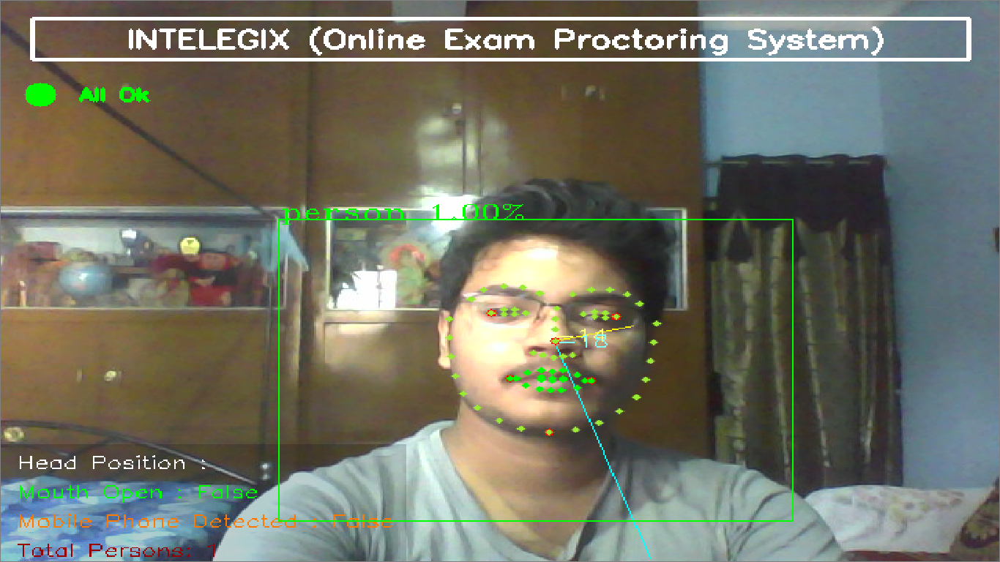
    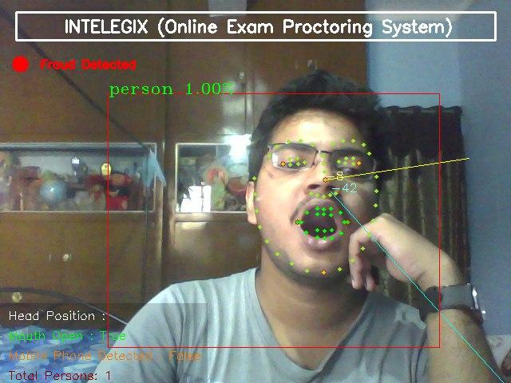
    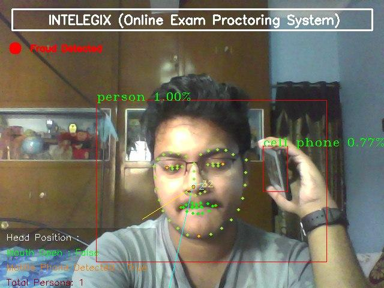
    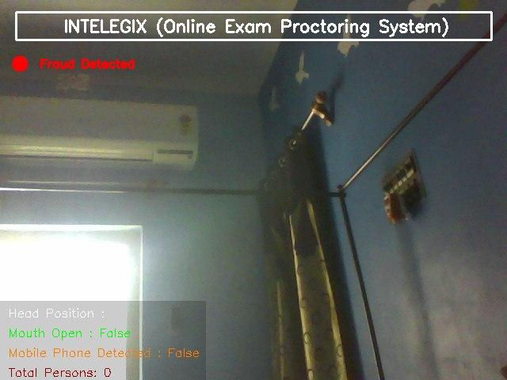
    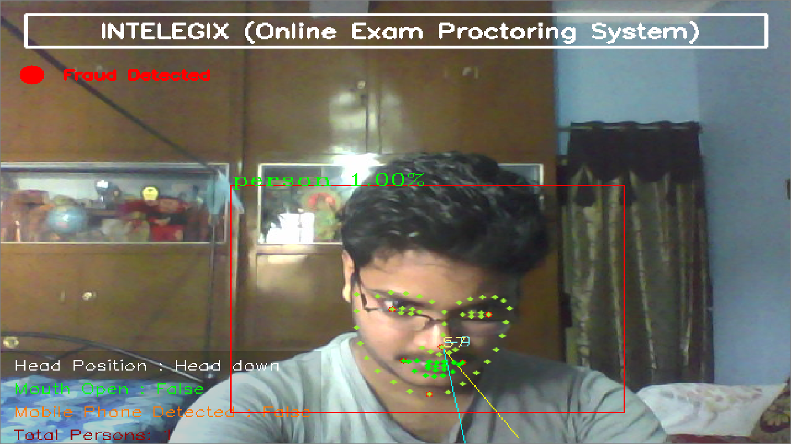
</p>


## AI COVID MONITORING

It is a Combined Computer Vision and Machine Learning Application that recognises a person and checks if he is maintaining social distancing or not , and also checks if he is wearing a mask or not simultaneously. 

If any of the two above criteria fails then its alerts a user concerned with a warning sound , so the person violating can take necessary steps to minimise the spread of the virus. 


It performs two primary functions using multi threading , OpenCV and ML


      1.  EYEXA uses yolov3 model to track a person and then does various internal computations to check all the person in the frame
    are maintaining a proper social distancing norms or not . and display the number of person violating the social distancing norms.
      
      2.  EYEXA uses an custom trained model based on MobileNetV2 to train on images of person wearing/not_wearing a mask , and 
    predict the person in the camera feed is wearing a mask or not . It also uses a res10_300x300_sad_iter_140000.caffemodel to focus
    on person face during the prediction.


### MASK DETECTION RESULT

<p align="center">
    
    
</p>


### SAMPLE RESULT

<p align="center">
    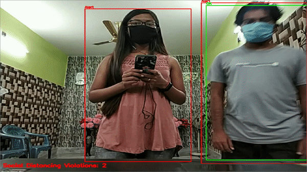
   
</p>


<p align="center">
    
</p>


## SAMPLE IMAGES
<p align="center">
    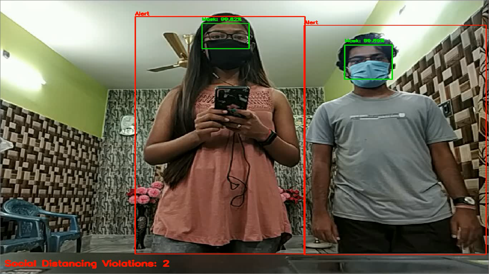
    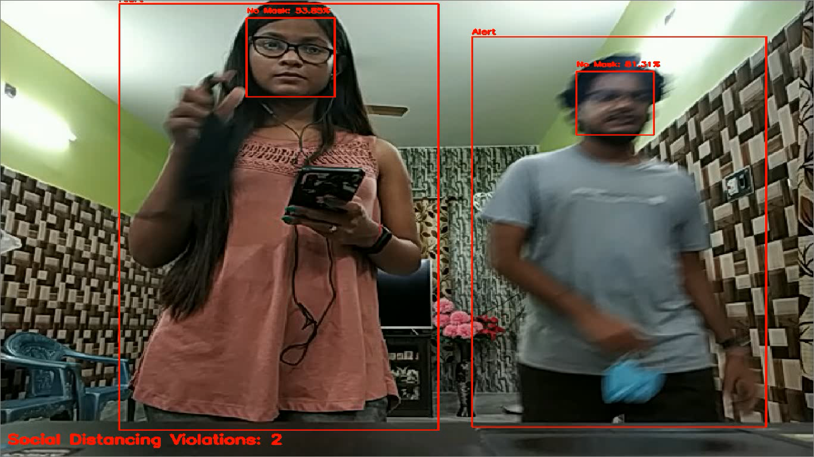
    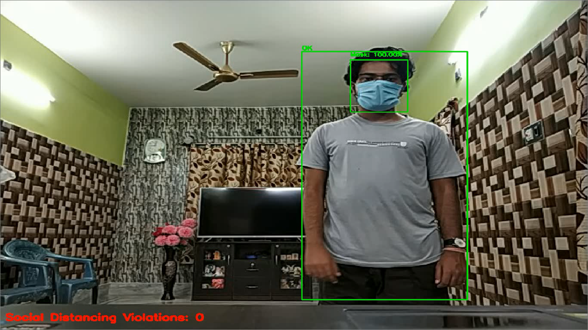
    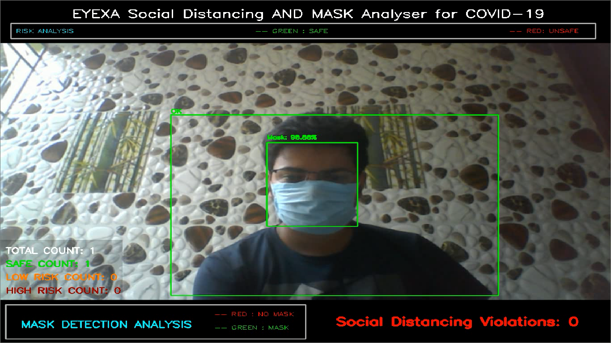
    <br>
    <sup>1.Social Distancing Violation but Mask are on (Left) 2.Social Distancing Violation and Mask are off(Right) 3 and 4. All Ok (Down Left/Right)</sup>
</p>


## AI DRIVER MONITORING SYSTEM :oncoming_bus:

Project to monitor driver behavior  while driving. If the application detects driver rules violation done by driver then it sends a warning/image to a Telegram/Whats App/Email through REST API.

##### PROBLEM STATEMENT

- School Buses: Driver drowsy, driver talking on cellphone while driving, driver/conductor smoking in the bus etc


<p align="center">
    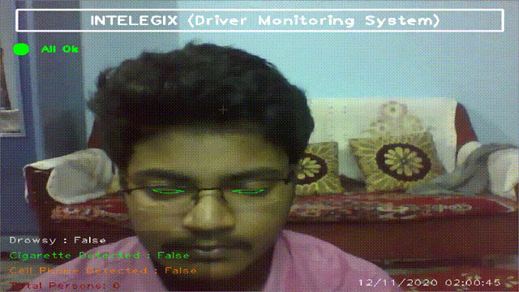
</p>


## Vision Statement

- It has five vision based functionalities right now:

    1. Detects if a Driver is drowsy.
    2. Uses a custom trained model based on yolov4 Darknet architecture to detect if a person is smoking while driving.
    3. Uses a custom trained model based on yolov4 Darknet architecture to detect if a person is using cell phone while driving.
    4. If the person in violating any of the above specified protocols then it signals violation.
    5. Sends the violating image sample in the Telegram Group Via Rest API with the use of Tokens and Bot.  


- Facial Landmarks to detect if driver is Drowsy

    To give landmarking on the eyelashes and if two lines on upper and lower eyelashes intersect the the application gives a warning message indicating the driver is Drowsey.
    
    It is implemented in `AI_DRIVER_MONITORING.py` and is used for tracking eyes,and eyelashes.
    


- Smoking and cellphone Detection while driving 

    `AI_DRIVER_MONITORING.py` is for detecting drivers using mobile phones and smoking while driving . It is based on a custom trained yolov4 architecture based Darknet Model.
    
    Tips to train a custom based yolov4 based object Detection model you can refer <a href="https://blog.roboflow.com/train-a-tensorflow2-object-detection-model/">here.</a>


<p align="center">
    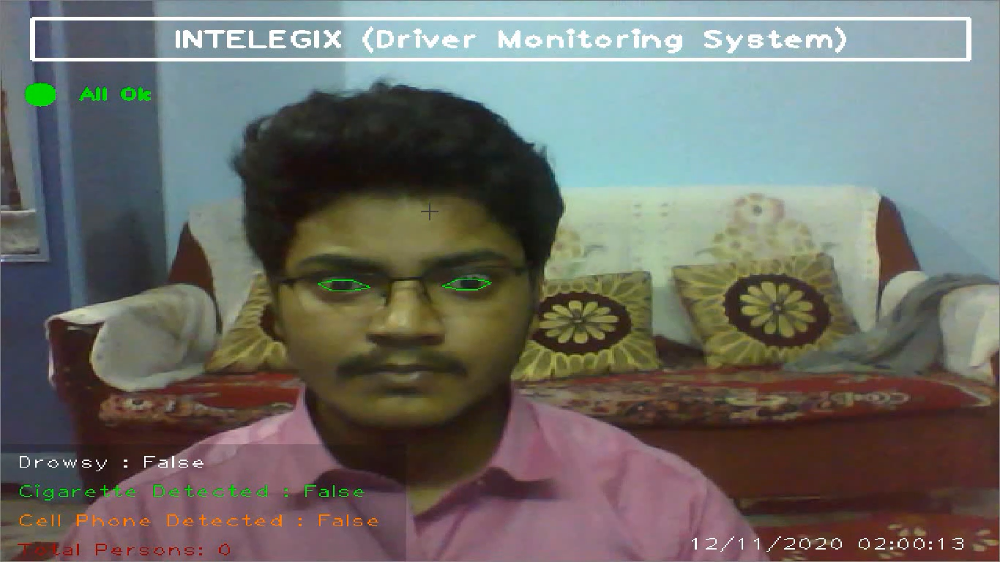
    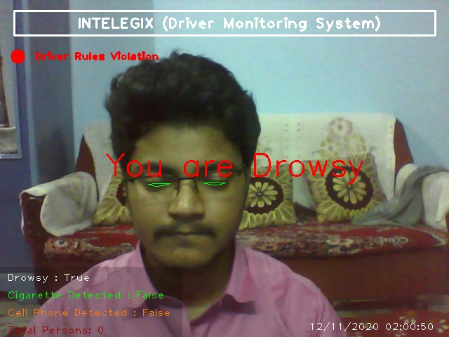
    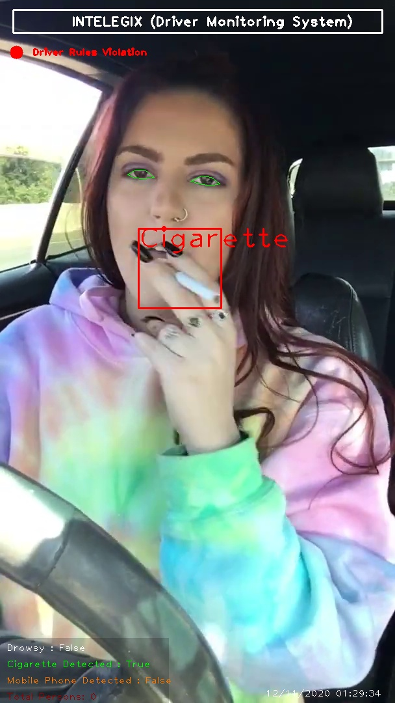
    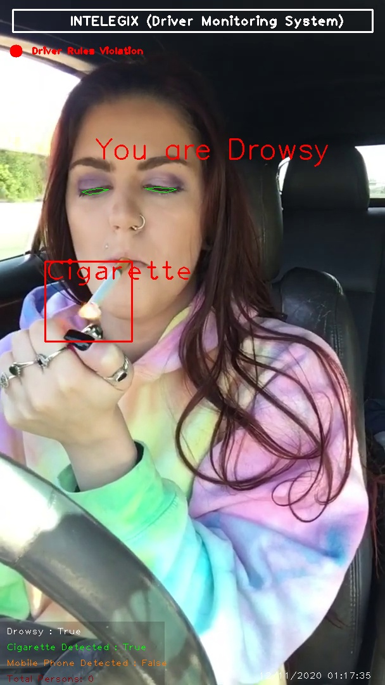
</p>


## AI HOSTEL MONITORING SYSTEM :no_pedestrians:


Project Hostel environment: Students outside dorms after designated timings, Unauthorized entry in campus. If the application detects a person in unauthorised area or after entry timings then it sends a warning/image to a Telegram/Whats App/Email through REST API.

##### PROBLEM STATEMENT

- Hostel environment: Students outside dorms after designated timings, Unauthorized entry in campus etc


<p align="center">
    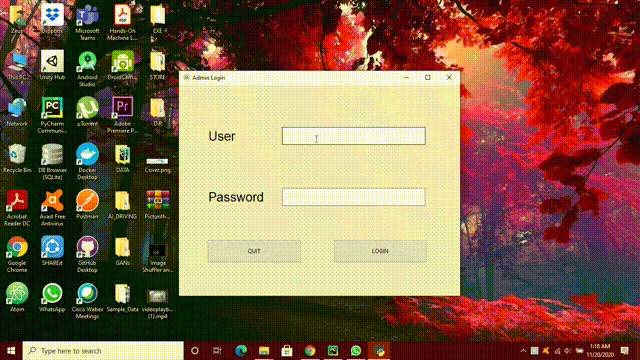
    <br>
</p>


## Vision Statement

- It has three vision based functionalities right now:

    1. Uses a custom trained model based on yolov4 Darknet architecture to detect a person.
    2. If the person in unauthorised area or outside dorms after designated timings then it signals violation.
    3. Sends the violating image sample in the Telegram Group Via Rest API with the use of Tokens and Bot.


## AI Corridor MONITORING SYSTEM :toilet:

Discipline in corridors and open areas, Gents entering ladies washrooms and vice versa. If the application detects a person in unauthorised washroom corridor after gender detection then it sends a warning/image to a Telegram/Whats App/Email through REST API.

##### PROBLEM STATEMENT

- Discipline in corridors and open areas, Gents entering ladies washrooms and vice versa, Detecting vandalism, Detecting medical emergencies etc

<p align="center">
    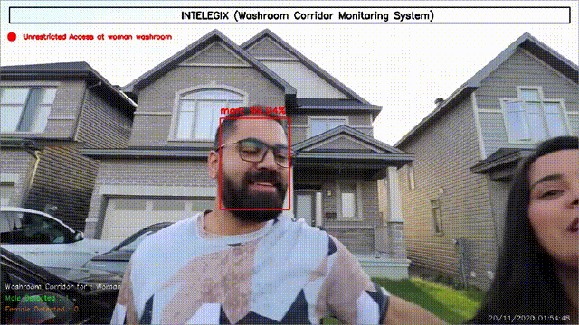
    <br>
</p>


## Vision Statement

- It has four vision based functionalities right now:

    1. Uses a custom trained model based on yolov4 Darknet architecture to detect a person.
    2. Uses a custom trained model to do gender detection on the person and show result.
    3. If the person is standing near a opposite gender washroom then it signals violation.
    4. Sends the violating image sample in the Telegram Group Via Rest API with the use of Tokens and Bot.
    


### FPS obtained

Functionality | On Intel i5
--- | ---
Mouth Detection | 7.2
Person and Phone Detection | 1.3
Head Pose Estimation | 8.5


# Getting Started

- Clone the repo and cd into the directory
```sh
$ git clone https://github.com/raj713335/PARIKSHA.git
$ cd INTELEGIX
```
- Delete the current Data folder inside PARIKSHA folder and then download the Data.zip from the given url and extract and copy the data folder in PARIKSHA folder

```sh
$ wget https://drive.google.com/uc?id=1YnA1wmaBoD3MPLEUWmZoUsvCsySB5Ng2&export=download
```

- Install Python 3.7.3 and its required Packages like tensorflow etc.

```sh
$ pip install EasyTkinter==1.1.0
$ pip install Pillow==8.0.1
$ pip install opencv-python==4.4.0.46
$ pip install requests==2.25.0
$ pip install configparser==5.0.1
$ pip install PyAutoGUI==0.9.52
$ pip install tensorflow==2.3.1
$ pip install scikit-learn==0.23.2
$ pip install wget==3.2
$ pip install pygame==2.0.0
$ pip install dlib==19.21.0
$ pip install imutils==0.5.3
$ pip install deepface==0.0.40
$ pip install keras==2.4.3
$ pip install cvlib==0.2.5
$ pip install PyQt5==5.15.2
$ pip install pyside2==5.15.2
$ pip install pyinstaller
```

- Run the app

```sh
$ python main.py
```


## Packaging the Application for Creating a Execulatle exe File that can run in Windows,Linus,or Mac OS

You can pass any valid `pyinstaller` flag in the following command to further customize the way your app is built.
for reference read the pyinstaller documentation <a href="https://pyinstaller.readthedocs.io/en/stable/usage.html">here.</a>

```sh
$ pyinstaller -i "favicon.ico" --onefile -w --hiddenimport=EasyTkinter --hiddenimport=Pillow  --hiddenimport=opencv-python --hiddenimport=requests--hiddenimport=Configparser --hiddenimport=PyAutoGUI --hiddenimport=numpy --hiddenimport=pandas --hiddenimport=urllib3 --hiddenimport=tensorflow --hiddenimport=scikit-learn --hiddenimport=wget --hiddenimport=pygame --hiddenimport=dlib --hiddenimport=imutils --hiddenimport=deepface --hiddenimport=keras --hiddenimport=cvlib --hiddenimport=PyQt5 --hiddenimport=pyside2 --name PARIKSHA main.py
```


